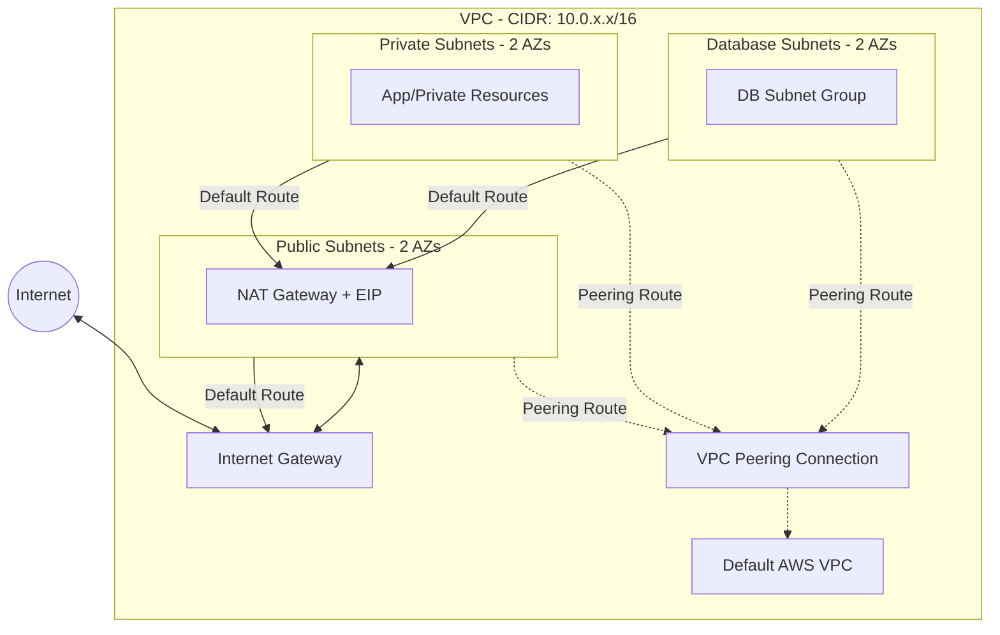

# Infrastructure Repository

This repository contains our infrastructure as code (IaC) configurations, managed with Terraform and automated via GitHub Actions CI/CD pipelines.

## 📂 Directory Structure

* **`.github/workflows/`**: Contains the GitHub Actions workflow files (`.yml`) for automating infrastructure deployments (e.g., triggering `terraform plan` on PRs and `terraform apply` on merges).
* **`environments/`**: Contains environment-specific infrastructure definitions and modules.
  * `dev/`: Development environment setup.
  * `stage/`: Staging/pre-production environment setup.
  * `prod/`: Production environment setup.
  * `modules/`: Contains reusable, shared local Terraform modules across all environments.
* **`vars/`**: Contains the Terraform variable definition override files (`.tfvars`) for each specific environment.
  * `dev.tfvars`: Values for the development environment.
  * `stage.tfvars`: Values for the staging environment.
  * `prod.tfvars`: Values for the production environment.

## 🚀 Usage

To deploy or make changes to a specific environment locally, make sure to pass the corresponding `.tfvars` override file to your Terraform commands.

### Deploying to Development
```bash
terraform init
terraform plan -var-file="vars/dev.tfvars"
terraform apply -var-file="vars/dev.tfvars"
```

### Deploying to Staging
```bash
terraform init
terraform plan -var-file="vars/stage.tfvars"
terraform apply -var-file="vars/stage.tfvars"
```

### Deploying to Production
```bash
terraform init
terraform plan -var-file="vars/prod.tfvars"
terraform apply -var-file="vars/prod.tfvars"
```

## 🛠️ CI/CD

All deployments are handled through GitHub Actions. 
- Opening a pull request will automatically trigger a `terraform plan` against the target environment.
- Merging to the main branch will trigger a `terraform apply`.

## 🏗️ Architecture & Code Explanation

This repository defines a robust AWS networking architecture using a reusable internal Terraform module (`environments/modules/vpc`).

### Diagram



### Module Breakdown (`environments/modules/vpc`)

1. **VPC & Gateway Basics**: 
   - Creates an AWS VPC (`aws_vpc.main`) with DNS hostnames enabled.
   - Deploys an Internet Gateway (`aws_internet_gateway.gw`) allowing public internet access.
2. **Subnets**: 
   - Generates Public, Private, and Database subnets intelligently across 2 defined Availability Zones using `aws_subnet` iterations (`count`).
   - Clusters the Database subnets into an `aws_db_subnet_group` for easy RDS instantiation downstream.
3. **Routing & NAT**:
   - Provisions an Elastic IP (`aws_eip.nat`) and a NAT Gateway (`aws_nat_gateway.nat`) pinned inside a public subnet.
   - Configures distinct Route Tables for Public, Private, and Database layers ensuring proper isolation. Public traffic is routed out via the IGW, while Private and Database outbound traffic dynamically routes through the NAT instance for secure patch/update fetches.
4. **VPC Peering (Optional)**:
   - Contains a feature flag switch (`var.is_peering_required`) to selectively generate a VPC Peering Connection (`aws_vpc_peering_connection.peering`).
   - If enabled and `acceptor_vpc_id` is empty, it automatically peers with the AWS account's Default VPC, and programmatically injects peering routes across all created route tables (Public, Private, Database) plus the Default VPC's main route table.

### Environment Instantiation (`environments/dev`)

- **`vpc.tf`**: Calls the internal `vpc` module providing custom tags, CIDR schemas (`10.0.1.0/24`, `10.0.11.0/24`, etc.), and enforcing VPC peering (`is_peering_required = true`).
- **`parameters.tf`**: Adds a secondary layer by capturing crucial output attributes (like VPC ID, public/private Subnet IDs strings, targeting DB Group name) and persisting them into **AWS Systems Manager (SSM) Parameter Store**. Subsequent backend/frontend infrastructure stacks can seamlessly query these parameters via data blocks avoiding complex remote-state coupling.
- **`provider.tf`**: Centralizes the AWS provider setup (`us-east-1`) and bootstraps remote state persistence inside a central S3 bucket (`kalyaneswar-remote-state`) safely coordinated by a DynamoDB lock tracking table (`kalyan-locking`).
